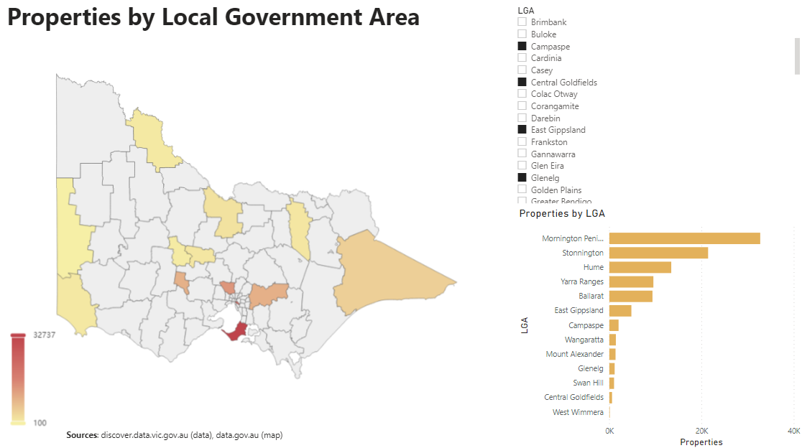

# Power BI Custom Visual : Interactived Map of Victorian LGAs

Simple custom Power Bi visual, displaying map with Local Government Areas in Victoria, Australia.

Visual built on R, using the following packages:

* [echarts4r](https://echarts4r.john-coene.com/) for charting
* [aussiemaps](https://carlosyanez.github.io/aussiemaps/) for the map data.

# How to use

# Disclaimer, this can be done in Power BI natively!

Please note that this map can be loaded into Power BI using the **Shape map** pre-built visual. You can find the topojson file (here)[https://github.com/carlosyanez/pbiviclga/blob/main/assets/vic_lga_topo.json].
